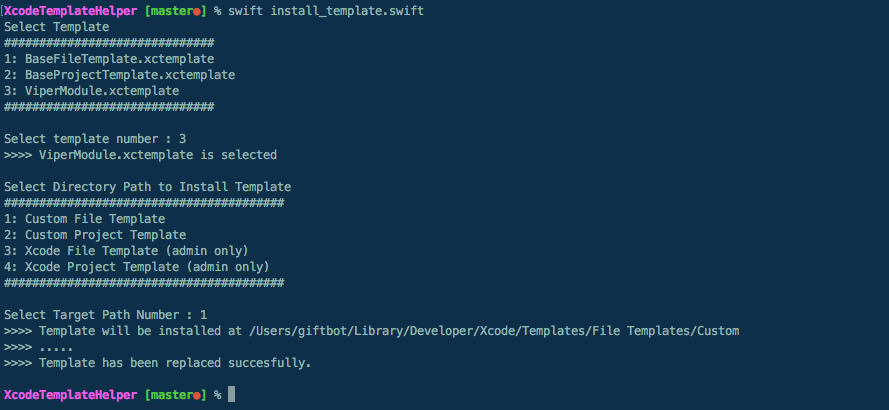
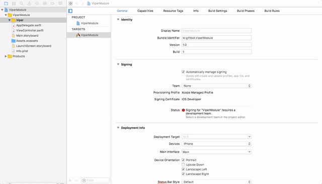
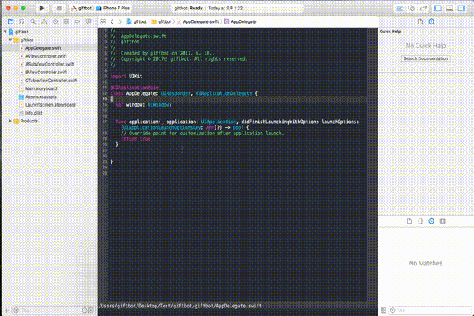
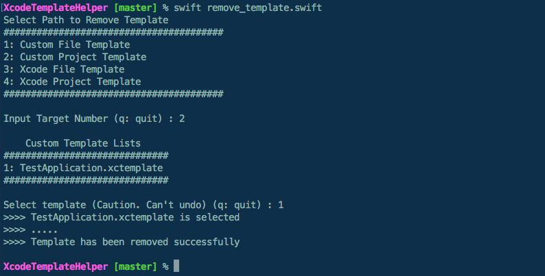

## Xcode Template Helper
Install Xcode Template with Ease.

- [How to Install](#how-to-install)
  - [Using Script](#1-using-script-strongly-recommend)
  - [Manual](#2-manual)
- [Template Usage](#template-usage)
- [Create Your Own Template](#create-your-own-template)
- [Remove Custom Template](#remove-custom-template)

## How to Install

### 1. Using script (strongly recommend)

- to install in `User Custom Path`
```shell
./template_helper
```

- to install in `Xcode application Path` 
```shell
sudo ./template_helper
```

- ##### ScreenShot
  


### 2. Manual

Copy & Paste command, or followed guide bellow. <br>
And don't forget to replace [TemplateName] with your real template name.

**[ File Template ]**

- to install in `User Custom Path`.

```shell
mkdir -p $HOME"/Library/Developer/Xcode/Templates/File Templates/Custom/[TemplateName].xctemplate/" && \
cp -R ./[TemplateName].xctemplate $HOME"/Library/Developer/Xcode/Templates/File Templates/Custom/"
```

- to install in `Xcode Application Path` 

```shell
tempDir=`xcode-select -p`"/Platforms/iPhoneOS.platform/Developer/Library/Xcode/Templates/File Templates/Source/" && \
sudo mkdir -p $tempDir/[TemplateName].xctemplate/ && \
sudo cp -R ./[TemplateName].xctemplate $tempDir
```


**[ Project Template ]**

- to install in `User Custom Path`.

```shell
mkdir -p $HOME"/Library/Developer/Xcode/Templates/Project Templates/Custom/[TemplateName].xctemplate/" && \
cp -R ./[TemplateName].xctemplate $HOME"/Library/Developer/Xcode/Templates/Project Templates/Custom/"
```

- to install in `Xcode Application Path` 

```shell
tempDir=`xcode-select -p`"/Platforms/iPhoneOS.platform/Developer/Library/Xcode/Templates/Project Templates/iOS/Application" && \
sudo mkdir -p $tempDir/[TemplateName].xctemplate/ && \
sudo cp -R ./[TemplateName].xctemplate $tempDir
```

Done. Now you can find your custom template in Xcode.<br>
Congratulations! 🎉🎉


## Template Usage
##### 1. File Template - ViperModule Template 



##### 2. Project Template - TestApplication Template




## Create Your Own Template

Do you want to create custom template? Do this.

```shell
sudo swift install_template.swift -g file
```

```shell
sudo swift install_template.swift -g project
```

These commands provide base template you can start with.

1. Get base template
2. Edit
3. Install

👌👌

※ Base file template is equal to **Xcode Swift template**.<br>
※ Base project template is eqaul to Xcode **Single View Application template**.

### ⚠️ Caution
**You must change `Identifier` of your custom project template** before install it to custom or xcode application path


## Remove Custom Template

### 1. Using script
Add `sudo` like install_template if you want to remove a template within xcode application path.                                  

```shell
swift remove_template.swift
```

- ##### ScreenShot
  

### 2. Manual

Just delete your custom template from the path that you have installed

## TODOs
- [ ] Documentation for TemplateInfo.plist
- [ ] Add more templates

### Contributing

Issues, Pull Requests and adding your custom template are always welcome.

### License

**Xcode Template Helper** is under the MIT license. See [LICENSE](LICENSE) for details.
