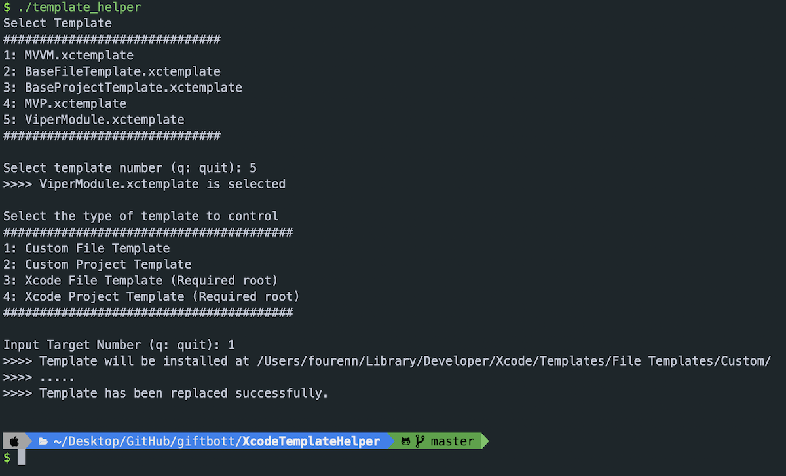
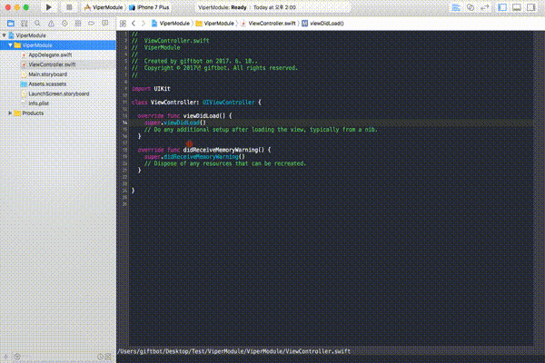
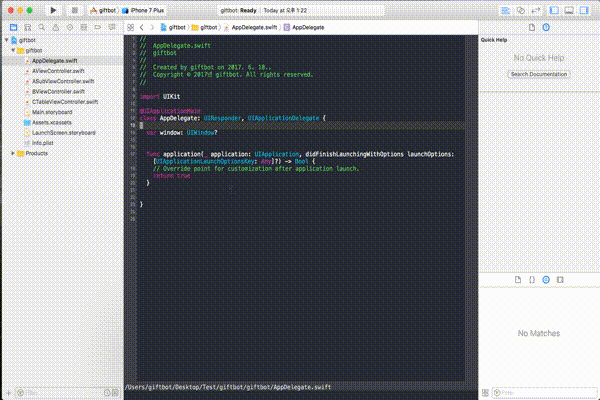
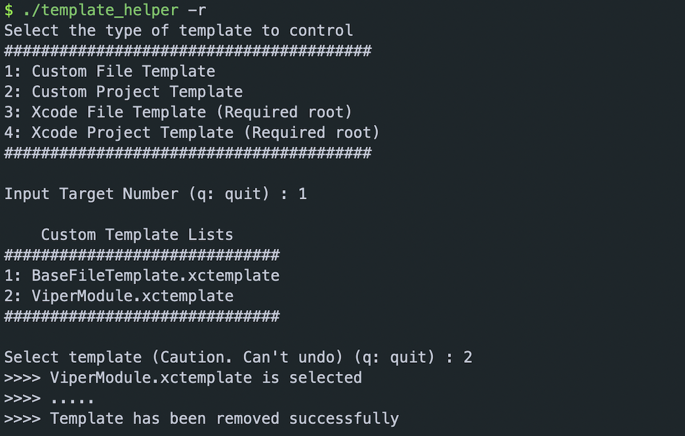

## Xcode Template Helper

Easily install Xcode templates.

- [How to Install](#how-to-install)
  - [Using a Script](#1-using-a-script-recommended)
  - [Manual Installation](#2-manual-installation)
- [Template Usage](#template-usage)
- [Create Your Own Template](#create-your-own-template)
- [Remove Custom Template](#remove-custom-template)

## How to Install

### 1. Using a script (recommended)

- to install in the `User Custom Path`:

  ```shell
  ./template_helper
  ```

- to install in the `Xcode application Path`:

  ```shell
  sudo ./template_helper
  ```

- ##### ScreenShot

  

### 2. Manual Installation

Copy & Paste the command below, or follow the guide.\
Remember to replace `TemplateName` with the actual name of your template.

#### **File Template**

- to install in the `User Custom Path`:

  ```shell
  mkdir -p $HOME"/Library/Developer/Xcode/Templates/File Templates/Custom/[TemplateName].xctemplate/" && \
  cp -R ./Templates/[TemplateName].xctemplate $HOME"/Library/Developer/Xcode/Templates/File Templates/Custom/"
  ```

- to install in the `Xcode Application Path`:

  ```shell
  tempDir=`xcode-select -p`"/Platforms/iPhoneOS.platform/Developer/Library/Xcode/Templates/File Templates/MultiPlatform/Source/" && \
  sudo mkdir -p $tempDir/[TemplateName].xctemplate/ && \
  sudo cp -R ./Templates/[TemplateName].xctemplate $tempDir
  ```

#### **Project Template**

- to install in the `User Custom Path`:

  ```shell
  mkdir -p $HOME"/Library/Developer/Xcode/Templates/Project Templates/Custom/[TemplateName].xctemplate/" && \
  cp -R ./Templates/[TemplateName].xctemplate $HOME"/Library/Developer/Xcode/Templates/Project Templates/Custom/"
  ```

- to install in the `Xcode Application Path`:

  ```shell
  tempDir=`xcode-select -p`"/Platforms/iPhoneOS.platform/Developer/Library/Xcode/Templates/Project Templates/iOS/Application" && \
  sudo mkdir -p $tempDir/[TemplateName].xctemplate/ && \
  sudo cp -R ./Templates/[TemplateName].xctemplate $tempDir
  ```

Done. You can now find your custom template in Xcode.\
Congratulations! 🎉🎉

## Template Usage

##### 1. File Template - ViperModule Template



##### 2. Project Template - TestApplication Template



## Create Your Own Template

Want to create a custom template? <br>
Start with Xcode's default template as a base.

```shell
sudo ./template_helper -g file
```

```shell
sudo ./template_helper -g project
```

These commands will provide a base template to start from.

1. Get the base template
2. Edit
3. Install your custom template

👌👌

※ The base file template is equivalent to the **Swift File.xctemplate**.<br>
※ The base project template is equivalent to the **App.xctemplate**.

### ⚠️ Caution

**You must change the `Identifier` of your custom project template** before installing it to the custom or Xcode application path.

## Remove Custom Template

### 1. Using a script

Simply add the `-r` option at the end. <br>
Add `sudo` when you want to remove a template from the Xcode application path, just like the install process.

```shell
./template_helper -r
```

#### ScreenShot



### 2. Manual Removal

Simply delete your custom template from the installed path.

### Contributing

Issues, Pull Requests, and adding your custom templates are always welcome.

### License

**Xcode Template Helper** is under the MIT license. See [LICENSE](LICENSE) for details.
